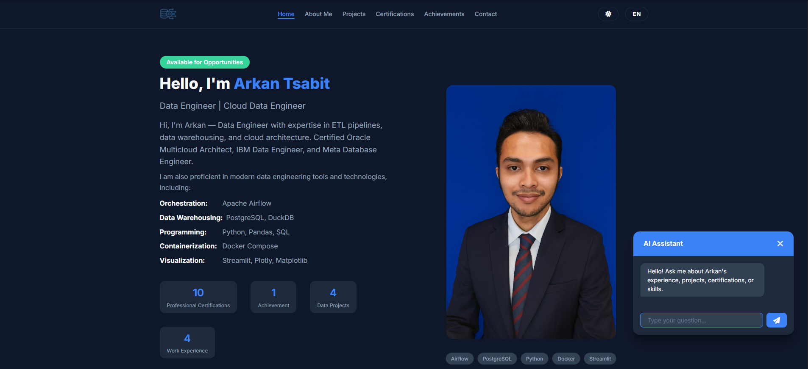

# Arkan Tsabit - Data Engineer Portfolio

## Personal Portfolio Website

[](https://arkantsabit123.github.io/arkan-tsabit.github.io/)
[](https://github.com/ArkanTsabit123)
[](https://linkedin.com/in/arkan-tsabit)
[](LICENSE)
[](https://pages.github.com)
[](https://arkan-chatbot.arkan-chatbot.workers.dev)
[](https://github.com/ArkanTsabit123/arkan-tsabit.github.io)
[](https://docs.google.com/spreadsheets/d/1zcck8oaWyw5aWOpNl4JqstaLFYhjMvh_aNvrr0adqAg/edit)

---

## Website Preview



**Live Website**: [https://arkantsabit123.github.io/arkan-tsabit.github.io/](https://arkantsabit123.github.io/arkan-tsabit.github.io/)

**Repository**: [https://github.com/ArkanTsabit123/arkan-tsabit.github.io](https://github.com/ArkanTsabit123/arkan-tsabit.github.io)

---

## About This Project

This repository contains the source code for a professional portfolio website that showcases data engineering work, certifications, and professional experience.

### Key Highlights

- **4 Data Engineering Projects** with detailed metrics and architecture
- **10 Professional Certifications** from Oracle, IBM, and Meta
- **AI-Powered Chatbot** using RAG (Retrieval-Augmented Generation)
- **Multi-Language Support** (English and Indonesian)
- **Dark/Light Mode** toggle
- **Contact Form** with Google Sheets integration

### Quick Stats

| Metric | Value |
|--------|-------|
| Projects | 4 |
| Certifications | 10 |
| Languages | 2 (EN, ID) |
| Pages | 6 |
| Knowledge Base Documents | 30 |
| Test Questions | 34 |

---

## Technology Stack

| Layer | Technology |
|-------|------------|
| Frontend | HTML5, CSS3, JavaScript |
| Hosting | GitHub Pages |
| AI Chatbot | Cloudflare Workers + RAG |
| Vector Database | Cloudflare Vectorize |
| LLM | Cloudflare Workers AI (Mistral 7B) |
| Contact Form | Google Apps Script + Google Sheets |

---

## Documentation

For complete project documentation, please refer to the `/docs/` directory:

| File | Purpose |
|------|---------|
| [INDEX.md](/docs/INDEX.md) | Complete documentation index |
| [blueprint.md](/docs/blueprint.md) | Full project documentation |
| [TECHNICAL.md](/docs/TECHNICAL.md) | Architecture, API, and performance |
| [OPERATIONS.md](/docs/OPERATIONS.md) | Maintenance, costs, and security |
| [GUIDE.md](/docs/GUIDE.md) | User flows and contribution guide |
| [CHECKLIST.md](/docs/CHECKLIST.md) | Project progress tracking |
| [CHANGELOG.md](/docs/CHANGELOG.md) | Version history |
| [cheatsheets.md](/docs/cheatsheets.md) | Quick reference commands |

---

## Quick Start

```bash
# Clone repository
git clone https://github.com/ArkanTsabit123/arkan-tsabit.github.io.git
cd arkan-tsabit.github.io

# Start local server
python -m http.server 8000

# Open browser
# http://localhost:8000
```

For detailed setup instructions, see [blueprint.md](/docs/blueprint.md).

---

## Contact

- **Email**: arkantsabit025@gmail.com
- **GitHub**: https://github.com/ArkanTsabit123
- **LinkedIn**: https://linkedin.com/in/arkan-tsabit
- **Website**: https://arkantsabit123.github.io/arkan-tsabit.github.io/

---

## License

This project is licensed under the MIT License. See the [LICENSE](LICENSE) file for details.

---

Built by Arkan Tsabit | Data Engineer | Cloud Data Engineer